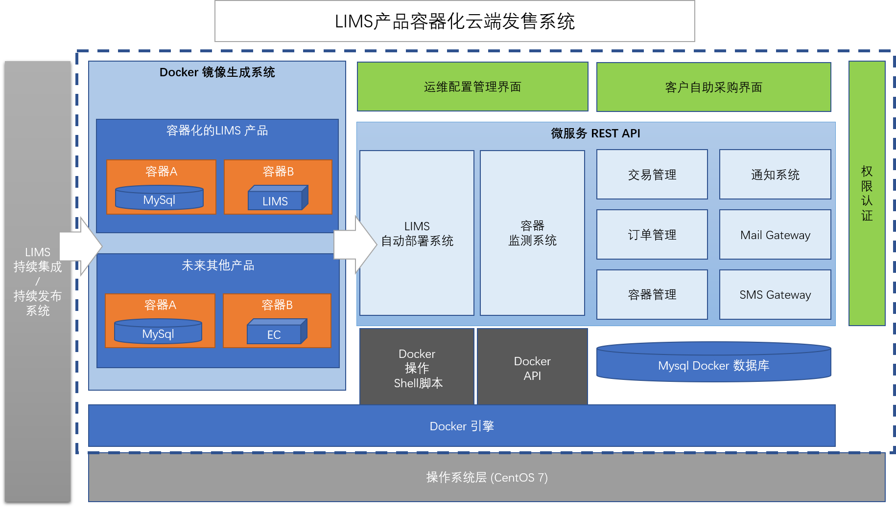
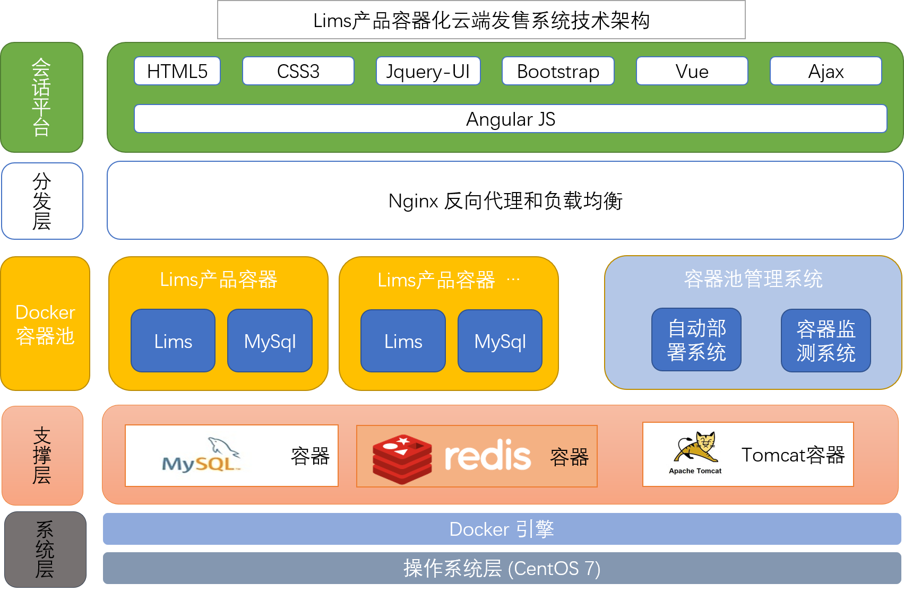
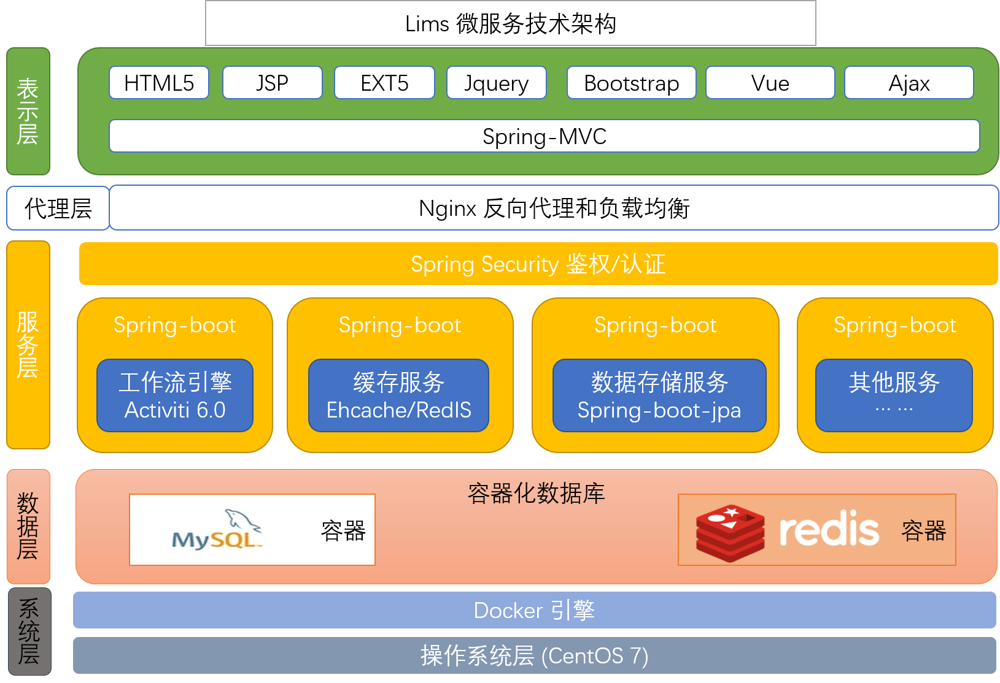

LIMS产品容器化云端发售系统
==
#### 系统逻辑架构 ####

蓝色虚线方框表示系统边界.   本系统的实现把Lims产品打包成Docker镜像, 并在目标客户完成付款后,自动为他部署好Lims生成环境, 打到开箱即用的效果.

- Lims CI/CD 系统 

左边灰色虚线框是LIMS产品的持续集成/持续发布系统,  它的输出是LIMS产品的jar/war 包, 作为右侧系统的输入.

- Docker镜像生成系统.

该系统把Lims产品打包成Docker Image, 目前Lims产品是有两个Image构成, Mysql 和 Lims Web应用.  改系统的输出会成为自动化发布系统的输入.

- 客户自助采购界面

供目标客户使用的系统, 提供产品介绍,在线采购, 容器信息查看等功能.

- 运维管理配置界面

提供给运维人员的界面, 提供订单确认, 容器状态监控, 容器控制等功能.

- 微服务Rest API 图中淡蓝色区域内包含的每个方框都是基于Spring-boot框架的微服务, 可以独立运行, 以REST API方式对外提供服务.
	- LIMS自动部署系统   当运维人员确认已经收到客户付款后, 系统会自动启动LIMS产品部署过程, 在数分钟内完成系统部署.
	- 容器监测   提供接口供其他系统查询容器状态信息, 接受其他体系发出的容器控制指令.
	- 交易管理   提供接口操作交易订单.
	- 通知系统   负责发出各种通知, 如催款(对客户), 容器异常警告(对运维).
	- 容器管理   供客户和运维人员调用, 对容器执行启动,停止等各种操作.
	- Mail Gateway   邮件网关, 用于向目标客户发送邮件.
	- SMS Gateway   短信网关, 用于向目标客户发送短信

- Docker操作shell脚本

自动化部署脚本, 供上层系统调用.

- Docker API

Docker 官方提供的容器操作的API封装.

- Docker 引擎

整个系统的技术支撑,  鉴于Docker "共享操作系统内核" 的特性, 我们在系统选型的时候,选择了Linux CentOS 7.0 版本, 本系统只能运行在Linux 操作系统之上.

Lims容器化云端发售系统技术架构
==

Lims微服务技术架构
==

	
