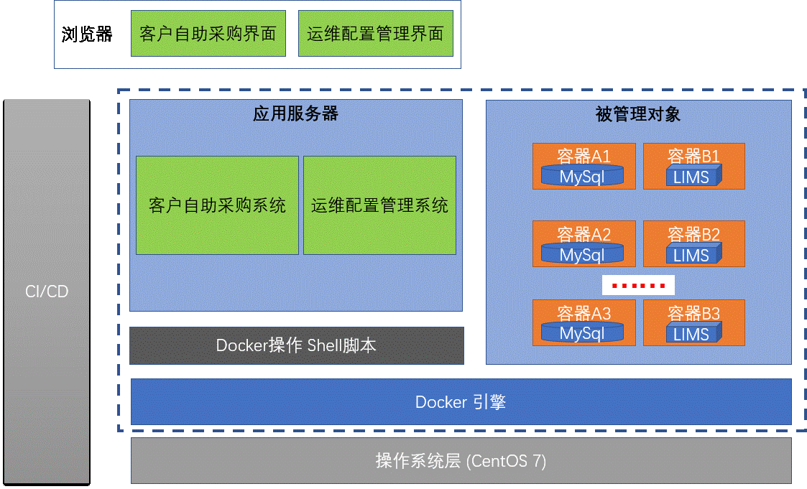

                                               LIMS 产品的容器化 

<span id="beginning" /> 
===

目录:
----
- [需求说明](#需求说明)
- [范围说明](#范围说明)
- [实施方案](#实施方案)
 * [产品镜像的生成 ](#产品镜像的生成 )
 * [产品自动发布 ](#产品自动发布 )
 * [客户自助采购系统 ](#客户自助采购系统 )
 * [运维管理系统 ](#运维管理系统 )
- [安全](#安全)

 

 

LIMS 产品的容器化
====
<span id="需求说明" /> 
## 需求说明 ##

为了简明扼要, 本文只列出高层次的用户故事. 

- 用户故事1

付费的客户在"用户自助购买系统"上点击购买按钮, 系统为该客户自动创建并部署系统.
- 用户故事2

运维人员可以方便的查看每个客户的容器的基本信息,健康状态, 存储的物理位置.

- 用户故事3

运维人员可以通过界面重启容器, 以便于在系统出现故障时快速恢复.

- 用户故事4

运维系统可以为每个客户生成对应的配置文件.


<span id="范围说明" /> 
## 范围说明 ##
下图是本系统的逻辑架构图, 蓝色虚线框部分表示本系统的边界.
- 客户自助采购界面/运维管理界面

用户通过浏览器访问应用服务器(客户自助采购系统, 运维管理系统), 来完成相应的功能.

- CI/CD (持续集成/持续发布) 系统

左侧的灰色框(CI/CD)系统是本系统的输入, 它把LIMS产品的源代码打成可以发布的war包和jar包. 这部分目前我们使用手工操作. 随着产品的逐步成熟和规范化, 未来我们考虑实现代码到产品镜像发布的全自动化. CI/CD 系统不在本系统范围之内

- 客户自助采购系统

提供给客户的操作界面, 付费后可以创建LIMS产品容器. 并提供基本信息查看功能.


- 运维配置系统

当客户的数量越来越多, 容器的数量也会越来越多, 我们必然需要一个小的数据库系统来记录客户和容器的对应关系.  每个客户的数据库都有自己的端口,  因此LIMS系统的数据源需要正确配置才能运行. 配置系统可以生成配置文件, 也可以在系统出现错误时提供一种快速恢复机制.

"运维管理系统" 屏蔽了Docker操作的复杂性, 以及Shell直接操作带来的误操作风险, 只提供了基本的操作.

- Docker操作Shell脚本

Shell脚本是应用服务器和Docker容器的纽带, 提供了产品创建和容器启动的所有操作.

- 被管理对象

每个客户都对应了两个容器实例: 数据库容器 和 LIMS容器.  '客户自助购买系统'通过shell脚本来管理这些容器.

- Docker引擎 / 操作系统

这是本系统运行的基础, 所有其他系统都运行在这个基础之上.




<span id="实施方案" /> 
## 实施方案 ##

下图表名了LIMS产品从代码到最总可线上购买所经理的流程.  

(虽然数据库初始化脚本有时候也被视为源码的一部分, 但是它并不是创建LIMS镜像的必要条件, 两者是可以完全解耦的.)


<span id="产品镜像的生成" />
### 产品镜像的生成  ###

<span id="产品自动发布" />
### 产品自动发布  ###

<span id="客户自助采购系统" />
### 客户自助采购系统  ###

<span id="运维管理系统" />
### 运维管理系统  ###

运维系统存在的价值如下:

一是Docker并不存在一套日志系统来记录它创建的容器是为谁创建的.  一旦容器的数量越来越多, 我们必然需要一个小的数据库系统来记录客户和容器的对应关系.

二是每个用户的数据库都有自己的ip地址和端口, 因此LIMS的配置文件必须做出相应的更改.  虽然这个动作也可以通过脚本完成, 但是毕竟不如放在应用系统里面实现并保存起来更加方便可靠. 一旦出现文件误删,可以快速的恢复.

<table width="100%">
 <tr><th>镜像名称</th><th> Owner ID</th><th> 存储路径</th><th>占用端口</th><th> 功能 </th> </tr>
 <tr><td>mysqlsunway</td><td> sunway </td><td>/home/docker/mysql/sunway</td><td>32767 </td><td> 重启服务/修复配置 </td> </tr>
 <tr><td>limssunway</td><td> sunway </td><td>/home/docker/mysql/sunway</td><td>32768 </td><td> 重启服务/修复配置 </td> </tr>
</table>

<span id="安全" /> 
## 安全 ##

 在生产环境中, 将避免使用root用户,  发布系统将创建 docker 用户, 并添加在sudo用户组里.

 用户自助采购系统将采用 "用户名+密码"认证方式, 密码用单向加密算法加密(暂定md5算法), 密码找回暂时定为采用邮件发生一次性有效的修改链接.

 用运维配置系统将采用 "用户名+密码"认证方式, 密码用单向加密算法加密(暂定md5算法), 密码找回暂时定为采用邮件发生一次性有效的修改链接.


主要步骤
=======
完成LIMS产品的容器化，主要需要完成如下几个过程。

1. 在宿主机器上安装Docker

2. 把数据库容器化

3. 把LIMS应用容器化

4. 发布LIMS


在宿主机器上安装Docker
=====

下面是Docker在CentOS Linux 下面的安装步骤， 如果你用的是其它操作系统可以点击如下链接查看官方网站对其他操作系统安装步骤的说明：
https://docs.docker.com/engine/installation/linux/docker-ce/centos/#install-using-the-repository 

```
yum install -y yum-utils device-mapper-persistent-data lvm2
yum-config-manager   --add-repo   https://download.docker.com/linux/centos/docker-ce.repo

yum install -y docker-ce
systemctl start docker

```
安装之后可以用下面的指令简单验证一下是否安装成功。

```
docker version
```


把数据库容器化
====
这进行这一步工作的时候，有一个非常终于的概念我们必须先弄清楚。  容器运行期间，所有发生在容器**内部**的改动，在容器关闭后都会丢失。 当你再次启动这个容器时，一切都回到了**出厂状态**。
正因为如此，我们必须把```数据库文件```和```数据库配置文件```**外部化**.

下面两个链接是MySQL官方提供的对镜像文件的详细说明，以及镜像是如何生成的。 虽然你不一定非要了解细节， 但是当你遇到困难时，了解这些内容有助于解决问题。

https://github.com/docker-library/mysql/blob/7a850980c4b0d5fb5553986d280ebfb43230a6bb/8.0/Dockerfile

https://github.com/mysql/mysql-docker 

MySQL 容器的初始化
----

创建用来保存数据库文件和数据库配置文件的目录
```
mkdir -p  /root/mysql/user1/data
mkdir -p  /root/mysql/user1/conf
```

copy the ```docker.cnf```  and  ```mysql.cnf```  from  source forder conf to  ```/root/mysql/user1/conf```
这些文件可以在说明文档一起发布的包里面找到。

```
docker run --name mysql -e MYSQL_ROOT_PASSWORD=sunway123# -d -p 3306:3306 \
    -v /root/mysql/user1/data:/var/lib/mysql  \
    -v /root/mysql/user1/conf:/etc/mysql/conf.d    mysql
```

**发生了什么？**
完成上面两个步骤后，外面的两个目录和容器内部的目录就完全共享了。
  /root/mysql/user1/data  => /var/lib/mysql
  
  /root/mysql/user1/conf  => /etc/mysql/conf.d 

  
如何从外部访问MySQL
---
mysql 超级用户 root
密码： sunway123#
ip地址可以到宿主机器上查看。

知道以上信息后，可以用任意第三方数据库客户端工具远程链接，并创建数据库。


如何从内部访问MySQL
----
执行如下指令，即可进入mysql容器内部。
```
docker container exec -it mysql bash
	mysql -u root -p 
	密码： sunway123#
```

	
LIMS 数据库初始化
---
(内容仅供参考，一切以LIMS实际发布的产品为准)

```
docker container exec -it mysql bash
mysql -u root -p 
CREATE DATABASE IF NOT EXISTS dbs_dev DEFAULT CHARSET utf8 COLLATE utf8_general_ci;
use dbs_dev;
source /var/lib/mysql/dbs_dev.sql
```

把LIMS应用容器化
===

创建Dockerfile. 
--------
这个是生产环境专用。LIMS打包到容器内部， 减少发布时间和与运维人员的沟通成本。


	#Create a LIMS image based on tomcat8
	FROM tomcat:latest
	COPY  iframework /usr/local/iframework
	COPY  server.xml /usr/local/tomcat/conf/server.xml

创建 Docker 镜像
---	
在做这个工作之前，要把最新版的LIMS 发布文件(iframework)和tomcat配置文件server.xml 复制到Dockerfile同一个目录下。
```
docker image rm sunway/lims:1	
docker image build -t sunway/lims:1  . 
```	
启动LIMS容器
----
	docker container run --name lims -d -p 8080:8080 sunway/lims:1  
 
点击如下链接尝试是否可以成功访问系统

http://192.168.1.30:8080/iframework

 
创建开发专用Tomcat容器
===	
特别说明:
--
	开发版容器使用步骤如下:
	1. 把LIMS复制到：/root/docker/mylims/iframework
	2. 启动定制化的tomcat容器。
		docker container run --name mylims -d -P \
		-v /root/docker/mylims/logs:/usr/local/tomcat/logs \
		-v /root/docker/mylims/iframework:/usr/local/iframework sunway/mylims 	
	3. 到这个目录查看日志： 
		/root/docker/mylims/logs
	4. 查看运行在哪个端口：  
		docker port mylims
	

创建Dockerfile
----
	# Setup a tomcat 8 as a development environment.
	FROM tomcat:latest
	VOLUME  /usr/local/iframework  /usr/local/tomcat/logs 
	COPY  server.xml /usr/local/tomcat/conf/server.xml

定制化Tomcat镜像 
---	
	docker image rm sunway/mylims
	docker image build -t sunway/mylims  . 
	
	
启动Tomcat容器
----
	docker container run --name mylims -d -P \
	-v /root/docker/mylims/logs:/usr/local/tomcat/logs \
	-v /root/docker/mylims/iframework:/usr/local/iframework sunway/mylims 
	
	docker exec -it mylims bash
	http://192.168.1.30:<port>/iframework

 

发布LIMS
===
当LIMS产品Docker容器化后，可以很方便的把LIMS产品发布到云端，部署时可以直接从云端下载。
由于Docker公司在美国，所以我们一般从国内的云平台购买Docker服务。

上传LIMS镜像
---
把我们前面创建好的LIMS镜像推送到云端。
```
	docker push <registry-host>:5000/sunway/lims:1
```	
下载LIMS镜像
----
从云端下载镜像，运行
```
	docker pull <myregistry.local>:5000/sunway/lims:1
	docker container run --name lims -d -p 8080:8080 sunway/lims:1  
	
```
这样客户就可以直接访问LIMS服务器了。

http://192.168.1.30:8080/iframework

文档结束

[Home](#beginning)