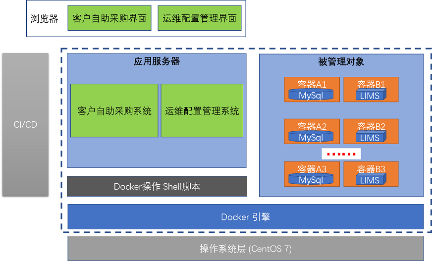
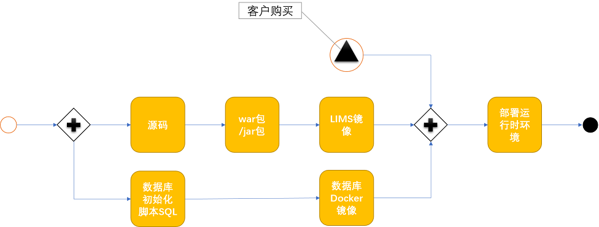
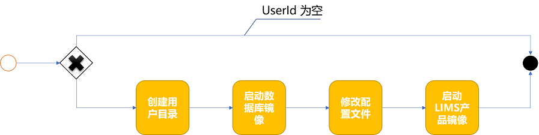
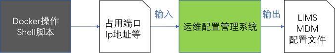
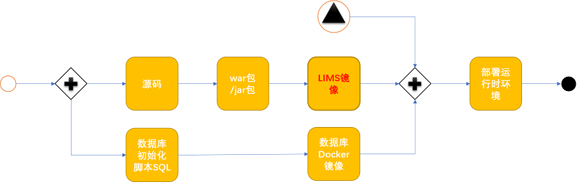
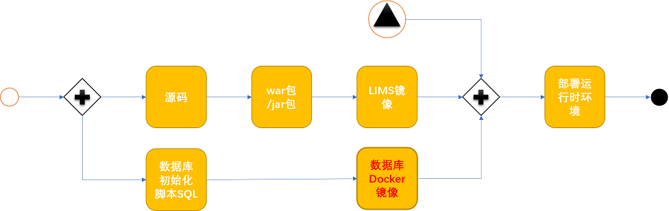

                                              
<center> LIMS 产品的容器化方案 </center> 
===

<div align="right"> 

<table width="100%">
<tr><th colspan="3" align="center"> 版本控制信息 </th> </tr> 
<tr><th>版本号</th><td>1.0</td></tr>
<tr><th>作&nbsp;&nbsp;者</th><td>齐俊波</td></tr>
<tr><th>审核人</th> <td>李明</td></tr>
<tr><th>最后更新时间</th> <td>2017/9/8</td></tr>
</table>

</div>

<span id="seg1" />

&nbsp;  
===

目录:
----
- [需求说明](#seg2)
- [范围说明](#seg3)
- [实施方案](#seg4)
 * [产品镜像的生成 ](#seg5)
 * [产品自动发布 ](#seg6)
 * [客户自助采购系统 ](#seg7)
 * [运维配置系统 ](#seg8)
- [安全](#seg9)
 * [Docer用户创建](#seg10)
 * [加密方式](#seg11)
- [数据备份](#seg12)
 * [异地备份](#seg13)
 * [网盘备份](#seg14)
- [风险](#seg15)

** 操作手册 **

- [Docker环境搭建](#seg16)
 * [安装Docker](#seg17)
 * [创建用户](#seg18)

- [LIMS产品容器化手册](#seg19)
 * [文件清单](#seg20)
 * [操作提示](#seg21)

- [MySQL容器初始化](#seg22)
 * [文件清单mysql](#seg23)
 * [操作提示mysql](#seg24)

- [自动化部署Shell脚本](#seg25)
 * [文件清单](#seg26)
 * [操作提示](#seg27)

- [发布LIMS](#seg28)
 * [上传LIMS镜像](#seg29)
 * [下载LIMS镜像](#seg30)

LIMS 产品的容器化 
====

<span id="seg2" />

需求说明
--

为了简明扼要, 本文只列出高层次的用户故事. 

- 用户故事1

付费的客户在"用户自助购买系统"上点击购买按钮, 系统为该客户自动创建并部署系统.
- 用户故事2

运维人员可以方便的查看每个客户的容器的基本信息,健康状态, 存储的物理位置.

- 用户故事3

运维人员可以通过界面重启容器, 以便于在系统出现故障时快速恢复.

- 用户故事4

运维系统可以为每个客户生成对应的配置文件.

<span id="seg3" />

范围说明
--

下图是本系统的逻辑架构图, 蓝色虚线框部分表示本系统的边界.



** 如下是架构图说明 ** 

- 客户自助采购界面/运维管理界面

用户通过浏览器访问应用服务器(客户自助采购系统, 运维配置系统), 来完成相应的功能.

- CI/CD (持续集成/持续发布) 系统

左侧的灰色框(CI/CD)系统是本系统的输入, 它把LIMS产品的源代码打成可以发布的war包和jar包. 这部分目前我们使用手工操作. 随着产品的逐步成熟和规范化, 未来我们考虑实现代码到产品镜像发布的全自动化. CI/CD 系统不在本系统范围之内

- 客户自助采购系统

提供给客户的操作界面, 付费后可以创建LIMS产品容器. 并提供基本信息查看功能.

- 运维配置系统

该系统主要用来为公司的多个产品(CRM, LIMS, MDM等)生成配置文件.

当客户的数量越来越多, 容器的数量也会越来越多, 我们必然需要一个小的数据库系统来记录客户和容器的对应关系.  每个客户的数据库都有自己的端口,  因此LIMS系统的数据源需要正确配置才能运行. 配置系统可以生成配置文件, 也可以在系统出现错误时提供一种快速恢复机制.

"运维配置系统" 屏蔽了Docker操作的复杂性, 以及Shell直接操作带来的误操作风险, 只提供了基本的操作.

- Docker操作Shell脚本

Shell脚本是应用服务器和Docker容器的纽带, 提供了产品创建和容器启动的所有操作.

- 被管理对象

每个客户都对应了两个容器实例: 数据库容器 和 LIMS容器.  '客户自助购买系统'通过shell脚本来管理这些容器.

- Docker引擎 / 操作系统

这是本系统运行的基础, 所有其他系统都运行在这个基础之上.


<span id="seg4" />

实施方案   
--

下图表名了LIMS产品从代码到最终可线上购买所经历的流程.  

(虽然数据库初始化脚本有时候也被视为源码的一部分, 但是它并不是创建LIMS镜像的必要条件, 两者是可以完全解耦的.)



<span id="seg5" />

### 产品镜像的生成  ###

每个客户对应2个镜像,  一个是LIMS产品镜像, 一个是数据库镜像. 

* 首先安装好Docker环境. [安装指南](#seg16)

* LIMS 镜像的生成  具体过程参考: [LIMS产品容器化手册](#seg19)

- 执行rebuild.sh  创建镜像.

- 执行restart.sh  启动Lims 演示环境.

* 数据库镜像的生成. 具体过程参考: [MySQL容器初始化](#seg22)

目前主流的持续集成/持续发布系统应该是下面这样的, 这对开发人员技能要求较高, 这是未来我们努力的方向.(按Ctrl + 鼠标滚轮可放大)


<span id="seg6" />

### 产品自动发布  ###

前端系统发起调用,并传入用户id时,  后台shell脚本会自动完成如下工作. (参考 [自动化部署Shell脚本](#seg25)



<span id="seg7" />

### 客户自助采购系统  ###  

这部分李季正在着手设计.   本文暂不提供具体方案.
Demo环境展示提供一个简单的单页面系统, 作为展示. 


<span id="seg8" />

### 运维配置系统  ###

这部分功能暂时还没有明确的方案, 但是我们对它的预期如下:

该系统主要用来为公司的多个产品(CRM, LIMS, MDM等)生成配置文件, 完成对数据源等信息的正确配置.



Docker并不存在一套日志系统来记录它创建的容器是为谁创建的.  一旦容器的数量越来越多, 我们必然需要一个小的数据库系统来记录客户和容器的对应关系.

每个用户的数据库都有自己的ip地址和端口, 因此LIMS的配置文件必须做出相应的更改.  虽然这个动作也可以通过脚本完成, 但是毕竟不如放在应用系统里面实现并保存起来更加方便可靠. 一旦出现文件误删,可以快速的恢复.

<table width="100%">
 <tr><th>镜像名称</th><th> Owner ID</th><th> 存储路径</th><th>占用端口</th><th> 功能 </th> </tr>
 <tr><td>mysqlsunway</td><td> sunway </td><td>/home/docker/mysql/sunway</td><td>32767 </td><td> 重启服务/修复配置 </td> </tr>
 <tr><td>limssunway</td><td> sunway </td><td>/home/docker/mysql/sunway</td><td>32768 </td><td> 重启服务/修复配置 </td> </tr>
</table>

<span id="seg9" />

安全    
--

<span id="seg10" />

### Docer用户创建 ###

在生产环境中, 将避免使用root用户,  发布系统将创建 docker 用户, 并添加在sudo用户组里.

```
useradd docker -g docker 	
```

<span id="seg11" />

### 加密方式 ###

 用户自助采购系统将采用 "用户名+密码"认证方式, 密码用单向加密算法加密(暂定md5算法), 密码找回暂时定为采用邮件发生一次性有效的修改链接.
 
 用运维配置系统将采用 "用户名+密码"认证方式, 密码用单向加密算法加密(暂定md5算法), 密码找回暂时定为采用邮件发生一次性有效的修改链接.

<span id="seg12" />

数据备份
--

数据备份的目的主要在于当系统因为人为(误删除, 黑客入侵)或者不可抗(断电,灾害)因素出现损坏时, 能够以最快的数据恢复服务, 将损失控制在可接受的范围之内.  因此, 为达到上述目的,  我们最常见的两种方式是[异地备份](#seg13)和[网盘备份](#seg14).

<span id="seg13" />

### 异地备份  ###

 1. 一种比较便捷的方式是在云提供商处采购机器时, 刻意选择不同的数据中心, 这样物理空间上,  虚拟机和备份机在不同的地理位置.  遭遇两个数据中心同时停电的机会小.

 2. 自己购买备份服务器.  因为云主机比较贵, 如果考虑经济因素,  自己购买机器, 定期下载数据.  不过考虑到下载带宽的限制, 这种省钱的方式效果比较差.

<span id="seg14" />

### 网盘备份  ###

 **  注意 **  这里说的网盘不是百度网盘.  百度网盘属于SaaS服务.  我们要的是IaaS服务, 使用起来和物理磁盘区别不大, 例如NAS网盘.

从云提供商(如阿里云) 购买磁盘空间,  并且用Linux Mount命令挂载在主机上,  这个用起来和本地文件夹一样, 但是物理空间上, 它在另一个机器上, 备份非常方便.   但是缺点是, NAS网盘一般都在同一个数据中心,  一旦数据中心停电, 肯定都停电了. 但是价格便宜.

<span id="seg15" />

风险 
---

### 已知风险: ###

 - 配置文件的生成

由于我们的机器将有多个数据库容器同时运行, 那么它们必然占用不同的端口.  这样LIMS产品的数据源也需要相应的配置.  我们使用容器的目的之一就是为了实现"可复制性",  所以我们从容器内部指向外部的一个配置文件.  那么LIMS产品的打包方式和数据源的配置方式是否允许配资文件外部化, 决定了我们发布流程的成败.

应对方案:  war包是不支持配置文件外部化的, 或者说支持的不好.  但是目录copy, 和spring-boot风格的jar包对配置文件外部化支持是没有问题的.
   
 -  数据库初始化脚本的质量

如下图所示,  数据库初始化sql 是 数据库镜像创建的前提条件.  由于我们系统sql偶尔变动, 会更新sql.  如果数据化自动创建的sql包含瑕疵, 执行出现错误,  那么镜像的启动就会失败.  所以严格把关sql质量非常重要. 

应对方案:  加强数据库文件的版本管理,  做好sql脚本的版本控制,  问题就很容易解决.

 

&nbsp; 
===

<center> 操作手册 </center> 
=== 

<span id="seg16" />

Docker环境搭建     
---

<span id="seg17" />

### 安装Docker ###

下面是Docker在CentOS Linux 下面的安装步骤， 如果你用的是其它操作系统可以点击如下链接查看官方网站对其他操作系统安装步骤的说明：
https://docs.docker.com/engine/installation/linux/docker-ce/centos/#install-using-the-repository 

```
yum install -y yum-utils device-mapper-persistent-data lvm2
yum-config-manager   --add-repo   https://download.docker.com/linux/centos/docker-ce.repo

yum install -y docker-ce
systemctl start docker

```
安装之后可以用下面的指令简单验证一下是否安装成功。

```
docker version
```

<span id="seg18" />

### 创建用户 ###

为了安全起见, docker 会使用单独的用户和组. 参考: [Docer用户创建](#seg18)

 
<span id="seg19" />

LIMS产品容器化手册     
---

<span id="seg20" />

### 文件清单: ### 

<table width="100%">
<tr><th>File Name</th><th>Description</th><th>备注</th> </tr>
<tr><td>lims/Dockerfile</td><td>用于创建基于Tomcat的Webapp镜像.</td><td>&nbsp;</td></tr>
<tr><td>lims/rebuild.sh</td><td>删除旧版本的lims镜像,生成新的.</td><td>危险操作</td></tr>
<tr><td>lims/restart.sh</td><td>重启lims 演示环境.</td><td></td></tr>
<tr><td>lims/server.xml</td><td>lims 默认配置文件, 其中的数据库jndi需要酌情修改.</td><td></td></tr>
</table>

<span id="seg21" />

### 操作提示: ###
 

- 创建工作目录, 由于lims产品目前不是war包或者jar包的形式, 所以首先要以文件夹的形式把部署文件copy在当前工作目录下.

```
mkdir -p  /home/docker/lims

## copy  <iframwork>  ./
## copy  servers.xml  ./

```

- 执行rebuild.sh  创建镜像.

- 执行restart.sh  启动Lims 演示环境.


<span id="seg22" />

MySQL容器初始化     
---

<span id="seg23" />

### 文件清单: ### 
 

<table width="100%">
<tr><th>File Name</th><th>Description</th><th>备注</th> </tr>
<tr><td>mysql/conf/</td><td> MySQL初始化配置 </td><td>&nbsp;</td></tr>
<tr><td>mysql/initsql/dbsdevbk.sql</td><td> LIMS 的数据库初始化脚本.</td><td>&nbsp;</td></tr>
</table>


<span id="seg24" />

### 操作提示: ###
 

-  create folders tobe binded with container

```
mkdir -p  /home/docker/mysql/user1/data
mkdir -p  /home/docker/mysql/user1/initsql
mkdir -p  /home/docker/mysql/user1/conf
```	
- Running custom init scripts at database creation
 
copy your  **create_db.sql** into folder  **/docker-entrypoint-initdb.d**,  the sql script will be executed on container start.

```
docker run --name mysql -e MYSQL_ROOT_PASSWORD=sunway123# -d -p 3306:3306 \
	-v /home/docker/mysql/user1/data:/var/lib/mysql  \
	-v /home/docker/mysql/user1/initsql:/docker-entrypoint-initdb.d \
	-v /home/docker/mysql/user1/conf:/etc/mysql/conf.d    mysql
 
docker container exec -it mysql bash

mysql -u root -p 
密码： sunway123#

```

- chek environment variables

```
mysqladmin -u root -p variables  | grep  "case"
```

### Reference ###

**Note:** 本文以MySql 8.0 为蓝本

https://github.com/docker-library/mysql/blob/7a850980c4b0d5fb5553986d280ebfb43230a6bb/8.0/Dockerfile

https://github.com/mysql/mysql-docker


<span id="seg25" />

自动化部署Shell脚本     
----

<span id="seg26" />

### 文件清单: ### 

<table width="100%">
<tr><th>File Name</th><th>Description</th><th>备注</th> </tr>
<tr><td>auto/createcontainer.sh</td><td>创建LIMS产品容器和数据库容器. 传入参数 userid </td><td> </td></tr>
<tr><td>auto/getmysqlport.sh</td><td>获取指定用户数据库容器占用的端口. 传入参数 userid</td><td> </td></tr>
<tr><td>auto/getport.sh</td><td>获取指定用户LIMS容器占用的端口. 传入参数 userid</td><td> </td></tr>
<tr><td>auto/startmysql.sh</td><td>测试脚本,启动demo环境数据库</td><td> </td></tr>
</table>

<span id="seg27" />

### 操作提示: ###

这些脚本都是给前端Webapp调用的, 原则上不提倡手动执行这些脚本. 避免前端系统的记录和后端的行为不一致.

<span id="seg28" />

发布LIMS      
---
当LIMS产品Docker容器化后，可以很方便的把LIMS产品发布到云端，部署时可以直接从云端下载。
由于Docker公司在美国，所以我们一般从国内的云平台购买Docker服务。

<span id="seg29" />

- 上传LIMS镜像

把我们前面创建好的LIMS镜像推送到云端。
```
	docker push <registry-host>:5000/sunway/lims:1
```	

<span id="seg30" />

- 下载LIMS镜像

从云端下载镜像，运行
```
	docker pull <myregistry.local>:5000/sunway/lims:1
	docker container run --name lims -d -p 8080:8080 sunway/lims:1  
	
```
这样客户就可以直接访问LIMS服务器了。


文档结束  

[Home](#seg1)