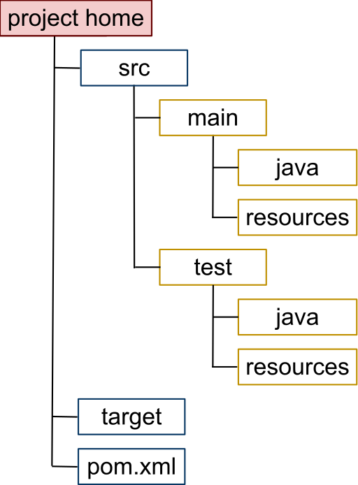

<center> 统一开发环境执行标准 </center> 
==


前言
--

** 约定优于配置 **  （convention over configuration），也称作按约定编程，这是一个古老的概念, 是一种软件设计范式，旨在减少软件开发人员需做决定的数量，获得简单的好处，而又不失灵活性。
这种思想在很多开源项目中都得到了体现, 如下图是Maven默认的目录结构, 如果你遵循这个结构, 不需要特别的配置, 编译器就可以找到源文件完成编译. 你固然可以不按这个规则来, 指定你自己的源文件路径, 那么你的pom.xml就会变得复杂.
机械行业有句话 "复杂的东西都不会长久", 道家说 "大道至简", 都是一个道理.




该标准的制定是以下面3点为出发点的, 抓住这个核心思想, 就不难理解为什么做出那样的规定了.

- 环境搭建, 项目发布,一键完成, 保证易用性.
- 开发环境, 项目jar包, 高度一致, 保证可靠性.
- 用项目文档来连接需求和最终的交付物, 保证项目的可追溯性.


开发环境
--

### 环境搭建

好的开始是成功的一半, 搭起一个项目框架最快的办法莫过于"原型模式". 这里有一个"样板工程",  复制一份, 改个名字, 你就不用一切从零开始了.

如下是"样板工程"文件夹结构及其含义:  (你会发现所有的脚本都不复杂, 使用了正确的方法, 一切都变得简单)

```
SampleProject:.
│  .classpath      # 当你双击 eclipse.cmd ,  这个文件会自动生成, 路径只在本地有效, 把这个文件上传到SVN是不专业的表现. 
│  .project        # 当你双击 eclipse.cmd ,  这个文件会自动生成, 路径只在本地有效, 把这个文件上传到SVN是不专业的表现. 
│  build.cmd	   # 自动打包脚本
│  eclipse.cmd     # 自动生成工程文件脚本
│  mvnw            #  Linux环境下maven环境自动搭建脚本
│  mvnw.cmd        #  Windows环境下maven环境自动搭建脚本
│  pom.xml         #  Maven 配置文件
│  README.md       # 项目文档总目录
│  jardeployment.sh #  jar包自动发布脚本
│  wardeployment.sh #  war包自动发布脚本
│  
├─.mvn
│  └─wrapper
│          maven-wrapper.jar         #  Linux 和 Windows环境下maven环境自动搭建插件
│          maven-wrapper.properties  #  maven 下载路径
├─doc
│  ├─环境配置      # eclipse 配置文件导出/导入
│  └─项目计划      # 项目管理计划  
├─src
│  ├─main
│  │  └─java
│  │      └─com
│  │          └─company
│  │              └─business      #项目包路径过深是一种恶习, 深到Windows无法管理, 这能给你带来什么好处呢? 
│  │                              #包是面向对象的"封装性"的策略,用来控制类的可见性的, 而不是用来做垃圾分类的文件夹.
│  └─test
│      └─java
│          └─com
│              └─company
│                  └─business
│                          ApplicationTests.java    # 测试类, 写不写测试类,是区分"正规军" 和 "草台班子" 的主要标识.
                        
```

该标准执行方式:
>  目录结构不符合本标准的,一律按本标准修改. 
                        
### jar包仓库(Maven Repository )


#### 包依赖的管理

你可能会注意到上面的工程目录里面没有一个叫 ** lib ** 的目录, 就是在过去很长一段时间用来放jar包的目录,  如果有这个目录 , 你可能会陷入一个困扰, 那就是时间久了, 很多jar包的版本没法确定,  同一个工具, 包含了几个不同版本的jar包,  jar包冲突, 某个jar包版本太低, 无法和其他的组件一起工作.

使用统一的依赖管理, 会明显减轻这方面的困扰.

```
<dependency>
	<groupId>org.springframework.boot</groupId>
	<artifactId>spring-boot-starter-test</artifactId>
</dependency>
```

该标准执行方式:
>  项目中不允许出现lib文件夹, 不允许用静态方式引入jar包. 

> 公司统一搭建企业maven库.

#### 项目依赖的管理

既然别人的jar包可以用这种方式来导入,  那么我自己的为什么不可以呢!

递归依赖一直是suanway诸多项目的一个顽疾,  拆分了多次也没见多大好转.   如果有些业务不适合作为一个单独的微服务, 那就让它 **模块化** 吧.


用下面这种方式, 用依赖jar包的方式来依赖一个工程.  这样jar包就没办法反过来再依赖工程了, 杜绝递归依赖.

```
<dependency>
	<groupId>com.sunwayword</groupId>
	<artifactId>sunway-workflow</artifactId>
	<version>1.0.3.RELEASE</version>
</dependency>
```

该标准执行方式:
>  项目中不允许出现lib文件夹, 不允许用静态方式引入jar包. 

#### 包命名规则

关于 common ,  我浏览了公司几个项目, 发现一个有趣的现象: 大家特别喜欢给自己的包名起个名字叫common,  类名叫Common Util, 究竟是什么东西如此通用, 一定要起个名字叫common呢?  仔细一看, 居然有些业务相关的代码, 也放进了 common包里面.

在我看来,  这些起名叫common的, 多半是懒得去想, 怎样取名字.  最后导致不该放在一起的东西都进了common这个包里面, 纠缠不清.
这里有一些建议. 包的名字可以这样取.

如果是REST 风格的, 

```
com.sunway.业务名称.repository
com.sunway.业务名称.service
com.sunway.业务名称.api.controller   #这里加个api, 是说明这个是无状态的, 有别于有状态的servlet 或则 action
com.sunway.业务名称.controller 
```

如果有个service是技术强相关的,  很多业务里面都用, 那也好办. 用技术名. 再怎么也强过用common
```
com.sunway.soup.service
com.sunway.xml.service
com.sunway.freemarker.service
```

该标准执行方式:
>  以上命名方式供参考, 不强制. 

### eclipse

-  由项目主管统一规定项目使用的 eclipse 版本号, 盗版myeclipse 一律禁止.
-  Eclipse 里面代码的格式化 formatter配置, 由项目主管导出, 其它成员一律使用同一个版本.

关于项目环境的规定, 都放在"环境配置"目录下,  口头说明无效.  

```
├─doc
│  ├─环境配置      # eclipse 配置文件导出/导入
│  └─项目计划      # 项目管理计划  

```

该标准执行方式:
>  各项目主管把 eclipse 设置导出, 放入上述文件夹, 提交到SVN, 成员统一导入.


文档管理
--

同文档相比, 口头表达有很多坏处.  比如: 项目需求, 需要合同的约束;  工作的安排, 需要有项目管理计划;  项目开发过程中留下来的中间产物, 叫做"组织过程资产",  是宝贵的学习资源.  口头的东西很快就会被遗忘, 死无对证 , 也没有法律效力.  妥善管理项目文档, 是成功必备的条件.

每个项目的根目录下都有个 ** Markdown ** 格式的 README 文件,  他是所有项目文档的总目录. 

```
│  README.md       # 项目文档总目录
```

该标准执行方式:
>  公司统一搭建wiki


项目wiki

项目管理一个重要的概率是"工作活动分解"(WBS),  每一项任务都可以变成wiki上的一个"话题",  开发人员可以通过"回帖", "贴图" 的方式把详细设计追加在这个"话题"的后面,  测试人员在测试的时候也好有个测试依据.  项目wiki可以把"需求"和最终"交付物"从头到尾串联起来, 使得项目"可追溯".

有很多Docker版的免费wiki可供使用, 如xwiki, mediawiki,  gitblog 等.

该标准执行方式:

>  公司统一搭建wiki

>  需求文档, 用户故事 逐步补充完整.


工程编译
--

每个项目的根目录下都有个 build.cmd,  它可以完成项目的自动打包.  该脚本必须保证在任何场景下生成的可部署包都是一致的.

```
│  build.cmd	   # 自动打包脚本
```
 
项目测试
--

- 每个 Service 都应该有白盒测试用例, 这是最低标准.


每个项目都应该有白盒测试, 是项目质量的最强有力的保证. 目前公司的测试基本上是人肉模式,  其测试速度完全跟不上版本更新的速度, 长期下去必然导致项目的质量失控. 

示例项目里面的这个脚本会默认执行所有的 test case,  如果白盒测试不通过, 不会生成war/jar包, 从而保证了最终发布的质量.
```
│  build.cmd	   # 自动打包脚本
```
 


自动发布
--

使用定时任务,自动执行项目中提供的打包脚本, 部署脚本就可以实现项目的自动发布.

项目中这两个脚本是自动发布 jar 包 和 war 包的示例,  ** 并不通用 **,  各项目主管参考该示例, 自行修改.

```
jardeployment.sh
wardeployment.sh
```


 